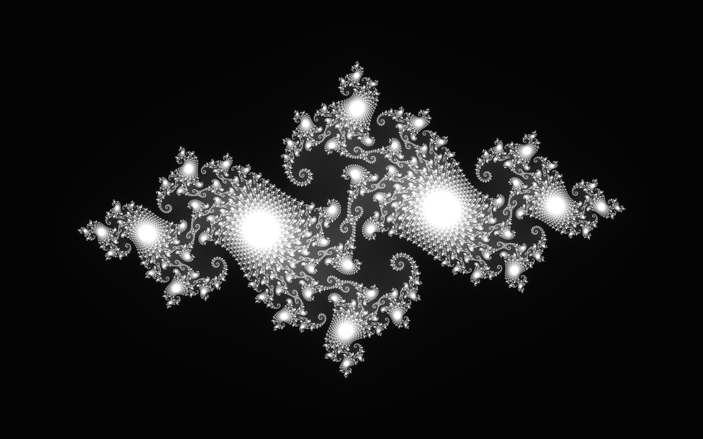

# GoExperiments
Go (language) Experiments

## Julia1.Go

purpose: test go float32 performance with channels and multiple workers 1 - 15 workers

compile: go build julia1.go
run: julia1.exe

example output (4 core Xeon with 2x Hyperthreading, around 8 is ideal):

	2017/04/28 00:46:35 8192x5120 i:255 tileSize:2 1. Time: 12.0298141s 100.00%  <--- no channels
	2017/04/28 00:46:41 8192x5120 i:255 tileSize:2 2. Time: 6.2214663s 51.72%
	2017/04/28 00:46:45 8192x5120 i:255 tileSize:2 3. Time: 4.2321429s 35.18%
	2017/04/28 00:46:49 8192x5120 i:255 tileSize:2 4. Time: 3.4234319s 28.46%
	2017/04/28 00:46:52 8192x5120 i:255 tileSize:2 5. Time: 3.0827799s 25.63%
	2017/04/28 00:46:55 8192x5120 i:255 tileSize:2 6. Time: 2.7098491s 22.53%
	2017/04/28 00:46:57 8192x5120 i:255 tileSize:2 7. Time: 2.4878196s 20.68%
	2017/04/28 00:47:00 8192x5120 i:255 tileSize:2 8. Time: 2.3853065s 19.83%   <--- hardware thread count
	2017/04/28 00:47:02 8192x5120 i:255 tileSize:2 9. Time: 2.385806s 19.83%
	2017/04/28 00:47:04 8192x5120 i:255 tileSize:2 10. Time: 2.5178236s 20.93%
	2017/04/28 00:47:07 8192x5120 i:255 tileSize:2 11. Time: 2.428312s 20.19%
	2017/04/28 00:47:09 8192x5120 i:255 tileSize:2 12. Time: 2.3458012s 19.50%
	2017/04/28 00:47:12 8192x5120 i:255 tileSize:2 13. Time: 2.345802s 19.50%
	2017/04/28 00:47:14 8192x5120 i:255 tileSize:2 14. Time: 2.3433006s 19.48%
	2017/04/28 00:47:16 8192x5120 i:255 tileSize:2 15. Time: 2.3082963s 19.19%  <--- faster noise or OS scheduler property

see Julia1Downsampled.png (GitHub version is downsampled save bandwith)

## CppJuliThreaded

purpose: C++ similar to Julia1.go to compare performance, implemented with pthreads (hard coded to 2 threads.)

Example output (32bit exe, compile with fast FloatingPointModel, same system as for Julia1.go stats):

     8192x5120 i:255 ... 4330 ms    <--- notice the same cost 6221ms in go, looks like 43% slower than C++
    

## JuliaServer.go and JuliaClient.html (JavaScript)

purpose: Simple WebServer in go and JavaScript UI to pan and zoom the result, JavsScript code can be useful to browse other data e.g. debug UV layout
 
Server: go, 16x16 tiles, a tile is 128x128, dat is sent as png, not multithreaded yet, can handle multiple client but no load balancing

Client: JavaScript using Canvas, bilinear filtering (Chrome is ok, Edge shows lines) with minor border artifact because of missing border, a tile is requested only once (timeout could be handled better)
 

 
